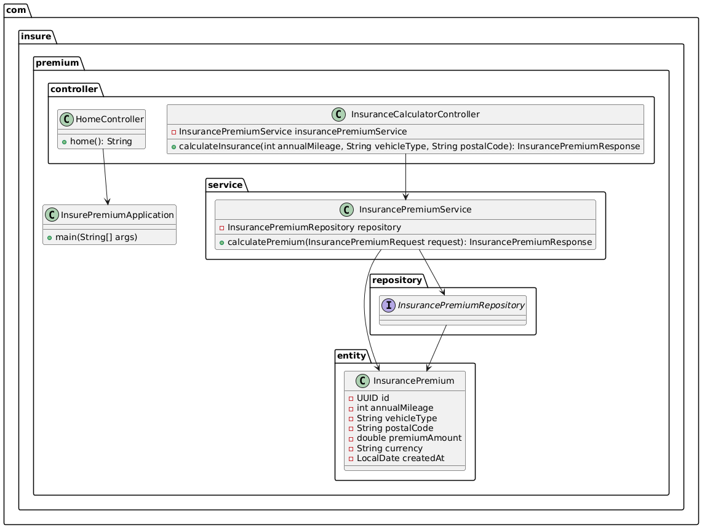

# Service zur Berechnung einer Versicherungsprämie

Dieses Projekt nutzt eine **Microservice-Architektur**, um eine **Versicherungsprämie** basierend auf der jährlichen Kilometerleistung, dem Fahrzeugtyp und der Region der Fahrzeugzulassung zu berechnen.

---

## Inhaltsverzeichnis

1. [Vorbedingungen](#vorbedingungen)
2. [Verwendung der Services](#verwendung-der-services)
   - [1. Docker-Container Setup](#1-docker-container-setup)
   - [2. UI in Browser öffnen](#2-ui-in-browser-öffnen)
3. [Microservice Architektur des Projekts](#microservice-architektur-des-projekts)
4. [Zusammenspiel der Komponenten](#zusammenspiel-der-komponenten)
5. [Technologien und Frameworks](#technologien-und-frameworks)
   - [Datenbank](#datenbank)
   - [Spring Boot](#spring-boot)
   - [Test-Framework](#test-framework)
6. [Verbesserungspotential](#verbesserungspotential)

---

## Vorbedingungen

Folgende Tools werden für die Ausfürhung der Anwendung benötigt: 

- **Docker**
- **docker-compose**

---


## Verwendung der Services
### 1. Docker-Container Setup


```bash
docker-compose up --build -d
```

### 2. UI in Browser öffnen
http://localhost:8081/

---

## Microservice Architektur des Projekts: 

Die Anwendung unterteilt sich in die folgenden drei Komponeten:
 1. ( [common](./common) ): Eine Libary , die die Elemente enthält, die von beiden Services verwendet werden: InsurancePremiumRequest und InsurancePremiumResponse.
 

 2. [insure-premium-service](./insure-premium-service): Service der die Usereingabe übernimmt und die Daten zur Versicherungsprämie in der Datenbank abspeichert.
 

 3. [premium-calculator](./premium-calculator): Dieser Service kapselt die Berechnungslogik der Versicherungsprämie. 


## Zusammenspiel der Komponenten

Die Kommunikation zwischen den beiden Services erfolgt über **HTTP-Nachrichten**. Der **premium-calculator** stellt eine **REST-Schnittstelle** bereit, die vom **insurance-common** über **POST-Anfragen** angesprochen wird.


Die vollständige Beschreibung der REST-Endpunkte ist in der Datei [**insurance-premium-endpoints.yaml**](./insurance-premium-endpoints.yaml) zu finden.

Durch die Aufteilung der Services – einen für die **Berechnungslogik** und einen für die **Usereingabe und Datenverwaltung** – wird gewährleistet, dass Änderungen an der Berechnungslogik keine Auswirkungen auf die Funktionalitäten des anderen Services haben.

---

## Technologien und Frameworks

### Datenbank

Für die Datenverwaltung wird eine PostgreSQL Datenbank verwendet.
PostgreSQL ist eine leistungsstarke und für Webanwendungen geeignete relationale Datenbank. 
Sie bietet vollständige ACID-Kompatibilität und ist daher besonders für komplexe Transaktionen geeignet. 
Als für dieses Projekt entschiedener Vorteil bietet PostgreSQL ein hohes Maß an Skalierbarkeit (ermöglicht jeweils vertikale und horizontale Skalierung ) und an Wartbarkeit (Open-Source-Community).

### Spring Boot
Die Services sind in Form von Springboot Applikationen umgesetzt worden. Dieses Framework wurde ausgewählt, dass es sich gerade in den Bereichen der Wartbarkeit (bspw. durch Dependency Injections)
und der Testbarkeit (Spring Boot Test, MockMvc, Testcontainers, JUnit, Mockito) auszeichnet. 

### Test-Framework 
Die folgenden Testframeworks wurden verwendet:

* **JUnit 5 (Jupiter)** für Unit-Tests
* **Mockito** zum Mocken von Objekten in Unit-Tests
* **Spring Boot Test-Framework** für das Testen von Spring-Boot-Komponenten
* **Hamcrest** zur Überprüfung von Werten in Tests

**Testabdeckung**: 
Die Tests konzentrieren sich vor allem auf funktionale Klassen, insbesondere Service- und Provider-Klassen. Klassen, die ausschließlich über Variablen und deren Getter- und Setter-Methoden verfügen, sind von den Tests ausgeschlossen.

**Testautomatisierung**: 
Die Tests werden automatisch über einen Maven-Build ausgeführt, um eine umfassende Testabdeckung zu gewährleisten.


## CI- Pipeline

Das Repository verfügt über eine CI-Pipeline, die jedes Mal bei der Erstellung eines PRs für den Master-Branch und bei einem Push auf den Master-Branch aktiviert wird. Über die entsprechenden GitHub Actions wird der Maven-Build inklusive der Testausführung für alle drei Java-Services durchgeführt. Durch die Einführung automatisierter Builds und Tests mit dieser Pipeline wird sichergestellt, dass neue Änderungen die Softwarequalität nicht beeinträchtigen.

---
## Verbesserungspotential:

* Die aktuelle GUI ist sehr einfach gehalten und soll nur der Usereingabe dienen. Eine zukünftige UI könnte mit React umgesetzt werden. Zum Testen der Weboberfläche könnte beispielsweise Playwright verwendet werden. Dieses Framework unterstützt unter anderen die Programmiersprache Java, mehrere Browser sowie das Testen von Moblie-Ansichten.
* Die Sicherheit optimieren: Statt Basic Auth und hartcodierter Authentifizierung sollte ein Autorisierungsmechanismus wie OAuth verwendet werden. Bei Basic Auth werden die Authentifizierungsdaten nur kodiert übertragen, was sie anfällig für Angriffe macht. OAuth hingegen nutzt ein zeitlich begrenztes Token, das die Sicherheit erhöht und wiederholte Passwortübertragungen vermeidet.
* Umfassenderes Error Handling umsetzten
* **Code-Reviews**:
	* Es sollte nicht direkt auf dem Hauptbranch gearbeitet werden. Dabei sollten Pull-Requests sollten unter Wahrung des 4-Augen-Prinzips überprüft werden.
